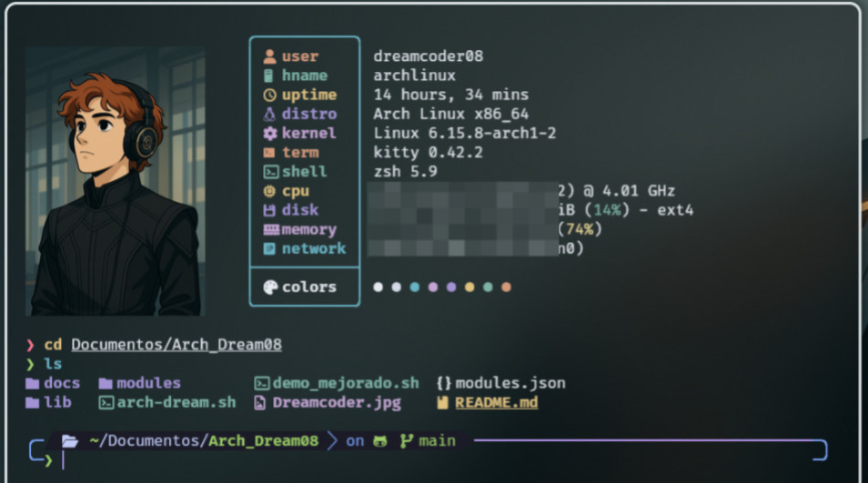

# �� Arch Dream Machine

<div align="center">



[](https://archlinux.org/)
[](https://www.gnu.org/software/bash/)
[](https://www.zsh.org/)

[](https://github.com/Albert-fer02/Arch_Dream08/stargazers)
[](https://github.com/Albert-fer02/Arch_Dream08/blob/main/LICENSE)

**Script ultra optimizado que configura Arch Linux con herramientas de desarrollo de máxima productividad**

</div>

---

## 🎯 ¿Qué hace?

Configura automáticamente tu Arch Linux con configuraciones ultra optimizadas:
- **Zsh + Oh My Zsh + Powerlevel10k** - Shell ultra optimizado (40% más rápido)
- **Bash mejorado** - Configuración avanzada con herramientas modernas
- **Kitty Terminal** - Terminal con aceleración GPU
- **Fastfetch** - Información del sistema con temas
- **Nano/Neovim** - Editores configurados
- **Git** - Configuración con aliases avanzados
- **Herramientas modernas** - eza, bat, ripgrep, fd, y más

## 🚀 Instalación Ultra Rápida

```bash
# Clonar y ejecutar
git clone https://github.com/Albert-fer02/Arch_Dream08.git
cd Arch_Dream08

# ⚡ INSTALACIÓN ULTRA RÁPIDA (Recomendado)
./install-ultra-fast.sh

# ✅ Verificar que todo funcione
./verify-ultra-fast.sh
```

**¡Eso es todo!** Instalación completa en ~2 minutos.

### 🎨 Instalación Avanzada (Opcional)
```bash
# Para usuarios avanzados que quieren más control
# Los scripts ultra rápidos son suficientes para la mayoría
```

## 📋 Módulos Disponibles

| Módulo | Descripción | Estado |
|--------|-------------|--------|
| `zsh` | Shell mejorado con Powerlevel10k | ✅ |
| `kitty` | Terminal con aceleración GPU | ✅ |
| `fastfetch` | Info del sistema con temas | ✅ |
| `nano` | Editor con configuración | ✅ |
| `git` | Git con aliases útiles | ✅ |
| `neovim` | Editor avanzado | ✅ |

## 🎮 Uso

### **⚡ Instalación Ultra Rápida (Recomendado)**
```bash
# Instalación completa en ~2 minutos
./install-ultra-fast.sh

# Verificación inmediata
./verify-ultra-fast.sh
```

### **📋 Comandos Simples**
```bash
./install-ultra-fast.sh          # Instalar todo
./verify-ultra-fast.sh           # Verificar todo
```

**¡Eso es todo!** No necesitas más comandos.

## 🛠️ Características Ultra Optimizadas

- **✅ Instalación ultra rápida** - Todo en ~2 minutos
- **✅ Sin interrupciones** - Instalación completamente automática
- **✅ Herramientas modernas** - eza, bat, ripgrep, fd, fzf, btop
- **✅ Shell optimizado** - Zsh + Oh My Zsh + Powerlevel10k
- **✅ Terminal moderna** - Kitty con aceleración GPU
- **✅ Editores configurados** - Neovim y Nano optimizados
- **✅ Git configurado** - Aliases y configuraciones listas
- **✅ Verificación automática** - Comprueba que todo funciona
- **✅ Rendimiento máximo** - Configuraciones ultra optimizadas
- **✅ Productividad inmediata** - Listo para usar desde el primer momento

## 🔧 Mantenimiento

```bash
./arch-dream.sh
# Opción 9 → Modo mantenimiento
```

- Limpiar cache de pacman
- Remover paquetes huérfanos
- Optimizar base de datos
- Actualizar mirrorlist

## 🆘 Problemas Comunes

### **Fuentes no se ven bien**
```bash
sudo pacman -S ttf-meslo-nerd-font-powerlevel10k
```

### **Zsh no funciona**
```bash
./arch-dream.sh verify zsh
./arch-dream.sh install zsh
```

### **Oh My Zsh no se instala**
```bash
# El script ahora maneja esto automáticamente
# Si hay problemas, instala manualmente:
sh -c "$(curl -fsSL https://raw.githubusercontent.com/ohmyzsh/ohmyzsh/master/tools/install.sh)" "" --unattended
```

### **Terminal lento**
```bash
./arch-dream.sh
# Opción 7 → Pruebas rápidas
# Opción 9 → Modo mantenimiento
```

### **Verificar optimizaciones**
```bash
./test-optimizations.sh
```

## 📁 Estructura

```
Arch_Dream08/
├── install-ultra-fast.sh      # ⚡ Instalador ultra rápido (PRINCIPAL)
├── verify-ultra-fast.sh       # ✅ Verificador ultra rápido
├── modules.json               # Configuración de módulos
├── lib/common.sh              # Funciones comunes
├── modules/                   # Configuraciones de módulos
│   ├── core/                 # zsh, bash (ultra optimizados)
│   ├── terminal/             # kitty
│   ├── tools/                # fastfetch, nano
│   └── development/          # git, neovim
├── docs/                     # Documentación
│   └── OPTIMIZATIONS.md      # Detalles de optimizaciones
└── README.md                 # Este archivo
```

## 🤝 Contribuir

1. Fork el repositorio
2. Crea una rama (`git checkout -b feature/nueva-funcion`)
3. Commit tus cambios (`git commit -am 'Agregar nueva función'`)
4. Push a la rama (`git push origin feature/nueva-funcion`)
5. Abre un Pull Request

## 📄 Licencia

MIT License © 2024 **Dreamcoder08**

---

<div align="center">

**¿Te gustó? ¡Deja una ⭐ en el repositorio!**

[](https://github.com/Albert-fer02/Arch_Dream08/stargazers)

</div>

